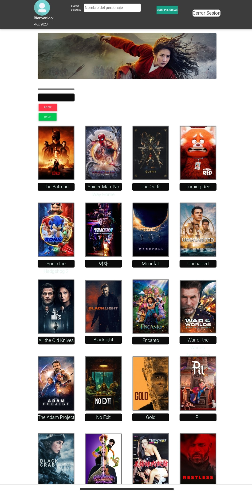

# BLOCK MASTER 

Block Master es la plataforma de contenido más reciente en el mercado pero a la vez la más potente. Descubre todas sus funciones en este genial proyecto de diseño.

## Desplegable
https://sprint3final.vercel.app/

## Sprint 3 Aplicación Block Master

Antes de correr el proyecto instalamos las dependencias:

### `npm i`

Para ejecutar el proyecto:

### `npm start`

## **Note: Cambiar la configuración en los siguientes archivos!**

En el archivo `firebaseConfig.js` cambiar la configuración por la de tu proyecto en firebase y en el archivo

`fileUpload` cambiar la dirección por la de tu carpeta de Cloudinary e igual que el `presetName` 

## Clonar 
 
Para clonar el repocitorio utilizamos el comando `git clone https://github.com/Lilop243/sprint3final.git` en nuestra consola de comandos CMD, y procedemos a instalar dependencias 

## Proyecto creado para ACADEMIA GEEK

